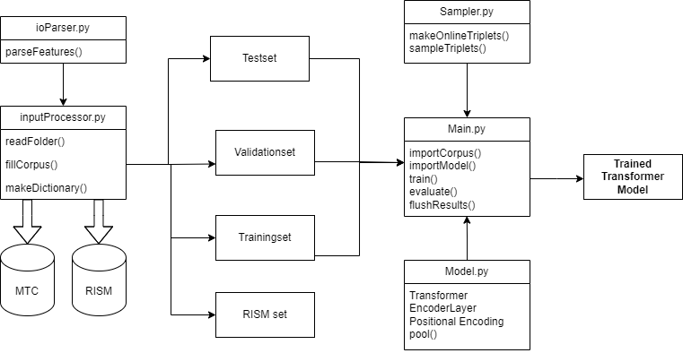

# Transformer model for melodic similarity
This project is primarily coded in Python, mainly because Python has convenient functionality and libraries for machine learning applications. For this implementation I used modules from PyTorch to abstract away unnecessary complexity and to reduce error margins. That being said, the architecture is mostly self-written to have the required control over all the parameters and to adjust the model architecture where needed to be suitable for the problem presented in this project. 

Figure \ref{fig:dataflow} shows a schematic overview of the implementation of this project. The arrows convey both dataflow and function inheritance depending on the context. Classes are written in Pascal Case, while functions are written in camelCase. A brief description of the scripts in figure \ref{fig:dataflow}: 

- Inputprocessor.py: This script will take care of getting the data into a form the network can accept; it performs all the preprocessing steps that were discussed in section 3.1.
- Model.py: Here the code relating to the transformer model resides.
- IOparser.py: The code to parse the features into the right format for the feature vector is written here (step 2 from the preprocessing pipeline).
- This script fulfils the purpose of organising, shuffling and sampling random triplets for the model to analyse.
- Main.py: Finally every part comes together in this script. This script initialises every component and controls the training environment.

This is the core functionality of the project; the rest of the implementation consists of visualisation, evaluation, tuning and helper functions. The code for training the model can be parallelised and is executed on a NVidea GeForce RTX 3070 GPU. Total training times can be found in appendix A. Instructions for executing the code are contained in the Readme of the github repository.
